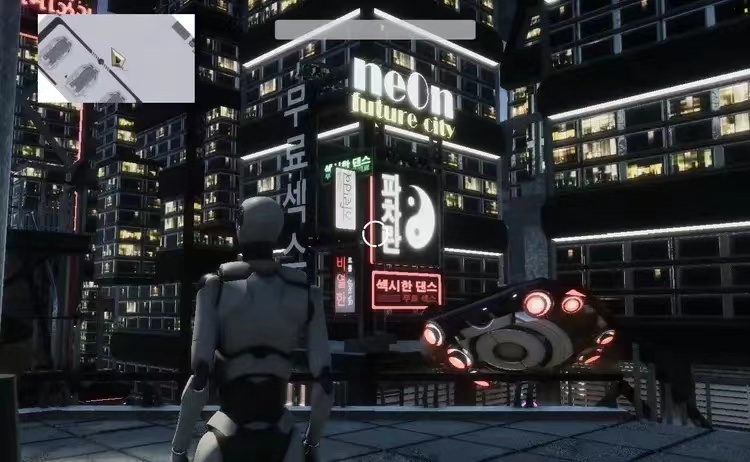
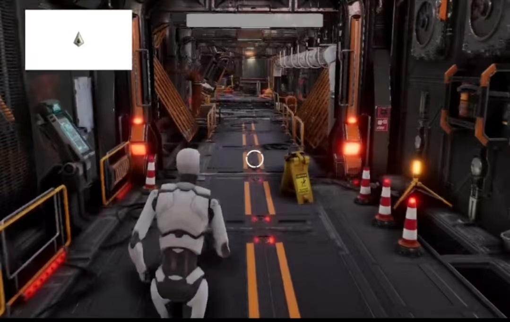

# Projekt-Function
An indi rpg game

## 分组
- 美术
- 核心程序
- 地编
- 场景物体编程
- 剧本
- 建模

## 加入组织

### 微信群
- 组长会拉你进群

### 飞书：团队交流平台

- https://www.feishu.cn/download 下载好了找组长要邀请码（过期太快了放不了码

### Trello：任务管理平台

- 下载Trello：https://trello.com/platforms

#### 加入工作区

- https://trello.com/invite/b/gTJ6jdpN/27c105a1fa9d5ffc0caa9102063b60f1/mission-board

#### Trello使用说明

- Questions: 待完成问题描述
- Next Up: 将在下一个sprint中出现的需求
- Current Sprint: 当前sprint中的所有需求
- On Hold: 当前sprint尚未分配/暂时搁置的需- 求
- In Progress: 当前sprint正在完成的需求
- Done: 当前sprint已完成的需求

其余列表为辅助作用，大家看列表名字就好

在一个Sprint完成后请将所有属于该Sprint的卡片全部归档

### Unity 组织

在unity官网注册账号并将账号邮箱发给组长

## 开发环境搭建

### 游戏引擎
- unity2020.3.15f2c1，详见技术知识积累>Unity基础>安装

### 渲染管线：
- HDRP

无需操作，只要下载工程文件即可

### 版本管理
- PlasticSCM（Unity Hub内置）

### 工程文件首次下载
1. 确保已经加入Unity组织，有疑问请私聊组长
2. 打开UnityHub并登录
3. 切换到PlasticSCM页面（上图）
4. 点击下载CUHK-Cyberpunk
5. 现在应能够在项目页面看到工程文件

### 标准操作程序SOP：
- 打开项目
- 拉取远程最新版本
- 开发
- 上传更改
- 关闭项目

### 代码编辑器

Visual Studio 2019 or higher + 安装时勾选For Unity Development
Visual Studio Code + Unity插件

- 从原型代码开发到合并进入主项目的工作流
原型代码（随便格式） -> 单元测试 -> 执行标准代码样式 -> 合并测试 -> 合并完成

## 开发

### 操作流程

请在开发中遵循以下标准操作流程，确保文件或工作进度不会丢失
PlasticSCM基础说明

1. 同步更改，修改项目前请务必先确认文件已同步完成！
2. 进行正常开发与更改，开发过程中请参考各小组文档
room场景中增加了Cube物体，在PlasticSCM中显示room.unity更改，此时：
3. 再次同步更改
4. 勾选希望上传的更改
5. 写简要的签入注释
6. 点击签入更改
7. 如果有更多更改请反复重复上传直到没有未上传更改为止
8. PS：任何阶段出现冲突，在不确定的情况下请截图发送到大群，紧急情况请选择远程版本
请仔细阅读开发规范 

### 开发模式

敏捷开发

（SCRUM为敏捷开发的一种形式)

了解敏捷开发：

油管：https://www.youtube.com/watch?v=9TycLR0TqFA

b站：https://www.bilibili.com/video/BV1rW411K7vD?share_source=copy_web
MEMEs😆：https://www.bilibili.com/video/BV1KW411T7Vw?share_source=copy_web

- 制作最小的可玩内容,不断进行堆栈更新内容
- 通过任务池来对人员进行派发

### 工作流

剧本 -> 场景描述 -> 原画 -> 原型地编 -> 场景物体编程 -> 组合

剧本：分为前期草案和后期打磨，前期草案需尽可能快完成，为其他工作提供基础参考

场景描述：根据剧本前期草案确定场景内需要的主要物件信息，包括外观，功能，交互行为等

原画：根据剧本前期草案画出概念美术图，为地编提供指引

原型地编：使用方块等简单的Unity内置形状摆放场景物体，根据原画，形成大概的布局

场景物体编程：根据场景物体的功能和交互行为对物体编程

组合：按原型地编替换占位方块为准备好的场景物体

## 社区（待建）

Discord

Twitter

Reddit

微博

Bilibili

WeChat
- 游研社微信群

QQ
- 游研社Unity讲座群

## 项目管理机制

### 组会机制
- 组会时间：每周一三五七晚 9点钟 半小时全组交流工作进展
- 参会人员：全体成员
其余时间不再开会